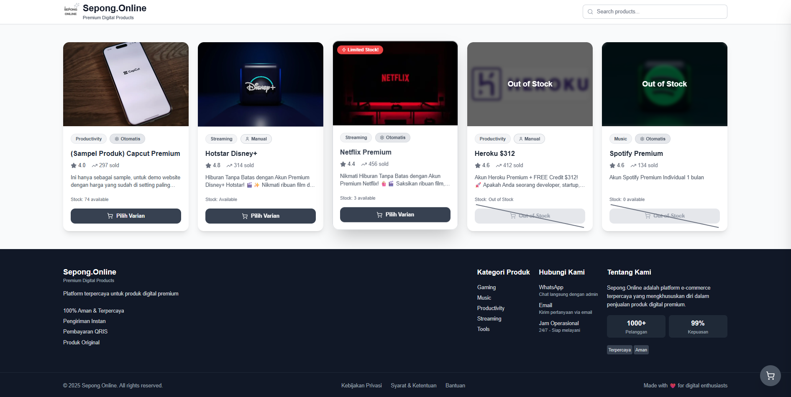

# DIGITAL STOREX - Platform E-Commerce untuk Produk Digital

Platform e-commerce modern untuk menjual produk digital (akun premium) dengan sistem pembayaran QRIS otomatis, WhatsApp Gateway terintegrasi, dan Telegram Bot Store.

## ⚠️ PENTING: Larangan Penjualan Ulang

**PERINGATAN**: Source code ini dilarang keras untuk dijual kembali atau didistribusikan ulang tanpa izin resmi dari developer. 

**Konsekuensi Pelanggaran:**
- Tidak akan mendapatkan update dan dukungan teknis
- Akan masuk dalam blacklist developer
- Dapat dikenakan sanksi sesuai ketentuan yang berlaku

**Untuk penggunaan komersial atau distribusi, silakan hubungi developer resmi.**

- [Facebook](https://fb.com/ahdxlo)
- [Telegram](https://t.me/yaelahda)

---

## 🚀 Fitur Utama

### 🛒 Customer Features
- **Homepage Modern** dengan UI responsive dan animasi menarik
- **Banner Carousel** dengan auto-slide dan drag/swipe support
- **Sistem Keranjang** tanpa perlu login (local storage)
- **Checkout Sederhana** hanya dengan nama dan No WhatsApp
- **Pembayaran QRIS** dengan dynamic QR code order
- **Auto-check Payment** setiap 10 detik
- **Order Success Page** dengan status real-time
- **Product Variant Support** dengan modal pemilihan varian
- **Search Products** dengan kategori filter
- **Dynamic Favicon & Title** berdasarkan settings toko

### 🔧 Admin Features
- **Dashboard Admin** dengan statistik lengkap (total orders, revenue, products)
- **Manajemen Kategori** (CRUD)
- **Manajemen Produk** (CRUD) dengan support multi-varian
- **Manajemen Akun** untuk setiap produk
- **Manajemen Varian Produk** untuk pricing berbeda
- **Banner Management** dengan drag & drop ordering
- **Histori Order** dengan status pembayaran
- **Admin Analytics** dengan grafik statistik penjualan
- **Payment Gateway Management** (multi-gateway support)
- **Settings Management** (store name, logo, favicon, dll)
- **Broadcast Messaging** via WhatsApp
- **Authentication JWT** dengan password terenkripsi

### 📱 Telegram Bot Store
- **Full E-Commerce Bot** untuk pembelian langsung via Telegram
- **Browsing Produk** dengan pagination
- **Detail Produk** dengan gambar dan informasi lengkap
- **Pilih Varian** untuk produk dengan multi-varian
- **Keranjang Belanja** dalam bot session
- **Checkout Process** dengan input nama dan WhatsApp
- **QRIS Payment** terintegrasi langsung
- **Order History** dari database
- **User Registration** otomatis saat menggunakan bot
- **Help Command** untuk panduan penggunaan

### 💬 WhatsApp Bot Store
- **Auto-Order via Chat** untuk pembelian langsung dari WhatsApp
- **Menu Command** `/menu` untuk lihat semua produk
- **Product Selection** dengan nomor atau teks
- **Variant Selection** support
- **IID Input Support** untuk produk yang memerlukan input custom (GetCID)
- **Order Confirmation** dengan konfirmasi ya/tidak
- **Cancel Command** `/cancel` untuk membatalkan proses
- **Help Command** `/help` untuk panduan

---

## 🔍 Detail Fitur

### 1. Sistem Keranjang
- Penyimpanan data keranjang menggunakan local storage
- Penambahan & pengurangan jumlah item secara real-time
- Perhitungan total harga otomatis
- Keranjang tersimpan meski browser ditutup
- Validasi stok saat checkout
- Support produk dengan varian (durasi, harga berbeda)

### 2. Sistem Pembayaran Multi-Gateway
- **Wahdx API (Orderkuota)** - QRIS dengan integrasi Orderkuota
- **Tripay** - QRIS dengan integrasi Tripay Gateway
- Dynamic QR code yang unique untuk setiap transaksi
- Status pembayaran real-time dengan auto-refresh setiap 10 detik
- Payment expiry manager untuk auto-cancel expired payments
- Notifikasi sukses/gagal pembayaran
- Riwayat transaksi tersimpan di database
- Admin dapat switch aktif gateway dari dashboard

### 3. WhatsApp Gateway Built-in
- Notifikasi otomatis ke admin saat order baru masuk
- Pengiriman detail akun ke pelanggan via WhatsApp
- Fitur template pesan yang customizable
- Pengiriman invoice digital via WhatsApp
- Auto-responder untuk pertanyaan umum
- **Bot Store** - customer dapat order langsung dari WhatsApp
- Fitur Broadcast - kirim pesan massal ke customer
- Session management dengan persistent auth
- Support send text dan image messages

### 4. Telegram Bot Store
- Customer dapat browsing dan order langsung dari Telegram
- Menu interaktif dengan inline keyboard buttons
- Session management per user
- Cart system dalam session
- Checkout dengan nama dan nomor WhatsApp
- Order tracking dengan history dari database
- User registration & database sync
- Support pagination untuk list produk

### 5. Manajemen Produk Digital
- Support multi-kategori produk digital
- Tipe produk: 
  - **automatic** - Akun otomatis dari database (Netflix, Spotify, dll)
  - **manual** - Input akun manual oleh admin
  - **automatic-api** - Produk dengan API eksternal (GetCID)
- Pengelolaan stok akun dengan sistem FIFO
- Upload akun massal via CSV/Excel
- Deteksi akun duplikat otomatis
- **Product Variants** - Support multi-varian dengan harga & durasi berbeda

### 6. Sistem Pengiriman Akun
- Pengiriman otomatis via WhatsApp setelah pembayaran terverifikasi
- Format pengiriman akun yang rapi (email:password)
- Validasi akun sebelum pengiriman
- Opsi pengiriman ulang jika terjadi kegagalan
- Riwayat pengiriman terekam di dashboard admin
- Notifikasi ke admin saat order sukses
- **GetCID Integration** - Auto-process GetCID setelah payment sukses

### 7. Banner Carousel System
- Manajemen banner dari admin dashboard
- Drag & drop untuk reorder banner
- Auto-slide dengan interval customizable
- Touch/swipe support untuk mobile
- Link URL untuk setiap banner
- Active/inactive toggle

### 8. Admin Analytics
- Grafik penjualan harian/mingguan/bulanan
- Total revenue tracking
- Order status breakdown
- Product performance metrics
- Customer insights

### 9. Settings Management
- Kustomisasi nama toko (`store_name`)
- Upload logo custom (`logo_url`)
- Upload favicon custom (`favicon_url`)
- Toggle notifikasi WhatsApp (admin/customer)
- Nomor WhatsApp admin (`admin_whatsapp`)
- Konfigurasi payment gateway

### 10. Keamanan
- Enkripsi data sensitif seperti password akun
- Rate limiting untuk mencegah brute force
- Validasi input di semua form
- Proteksi endpoint admin dengan JWT
- Logging aktivitas mencurigakan
- HTTP-only cookies untuk JWT token

---

## 🛠️ Tech Stack

### Frontend
- **Framework**: Next.js 15 dengan App Router
- **Language**: TypeScript
- **Styling**: Tailwind CSS
- **State Management**: React Context API
- **Form Management**: React Hook Form + Zod validation
- **UI Animation**: Framer Motion (rencana)
- **Icons**: Lucide React
- **Notifikasi**: React Hot Toast
- **Charts**: Recharts untuk admin analytics
- **Drag & Drop**: @hello-pangea/dnd untuk banner ordering

### Backend
- **Server**: Next.js API Routes + Custom Server (server.js)
- **Database**: MongoDB dengan Mongoose ODM
- **Authentication**: JWT (jsonwebtoken) + HTTP-only cookies
- **Password Security**: Bcrypt untuk hashing
- **Image Processing**: Sharp untuk optimasi gambar
- **Caching**: SWR untuk data fetching

### WhatsApp Gateway
- **Library**: Baileys untuk koneksi WhatsApp Web
- **Auth State**: MongoDB session storage
- **Message Handling**: Queue system with retry mechanism
- **Bot Handler**: Full e-commerce bot dengan ordering
- **Notification Service**: Admin & customer notifications
- **Media Support**: Gambar, PDF dan dokumen

### Telegram Bot
- **Library**: Telegraf v4
- **Features**: Inline keyboards, callbacks, sessions
- **Database Sync**: User registration ke MongoDB
- **Cart System**: Session-based cart management

### Payment Processing
- **Wahdx API (Orderkuota)**: QRIS integration utama
- **Tripay**: Alternative QRIS gateway
- **Payment Status**: Auto-check dengan interval 10 detik
- **Payment Expiry**: Auto-cancel untuk expired payments
- **Transaction Logging**: MongoDB transaction support
- **QR Code**: qrcode library untuk generate QR

### DevOps & Deployment
- **Version Control**: Git + GitHub
- **Process Manager**: PM2 untuk production
- **Reverse Proxy**: Nginx support
- **SSL**: Certbot/Let's Encrypt support

---

## 📋 Prerequisites

- Node.js 20.x
- npm 10.x
- MongoDB Atlas account atau MongoDB local
- ORKUT credentials untuk QRIS API (menggunakan Wahdx-API)
- Tripay credentials (jika menggunakan Tripay)
- Telegram Bot Token (untuk Telegram Bot Store)

---

## 📱 Bot Commands

### Telegram Bot
| Command | Description |
|---------|-------------|
| `/start` | Mulai bot dan tampilkan main menu |
| `/menu` | Tampilkan menu utama |
| `/products` | Lihat daftar produk |
| `/cart` | Lihat keranjang belanja |
| `/orders` | Lihat riwayat pesanan |
| `/help` | Panduan penggunaan bot |

### WhatsApp Bot
| Command | Description |
|---------|-------------|
| `/menu` | Lihat daftar produk yang tersedia |
| `/help` | Panduan penggunaan bot |
| `/cancel` | Batalkan proses yang sedang berjalan |
| `(nomor)` | Pilih produk/varian berdasarkan nomor |
| `ya` | Konfirmasi pesanan |
| `tidak` | Batalkan konfirmasi |

---

## 📞 Dukungan

Untuk demo, bantuan atau pertanyaan, silakan hubungi owner

Ahda :   [Facebook](https://fb.com/ahdxlo)
         [Telegram](https://t.me/yaelahda)